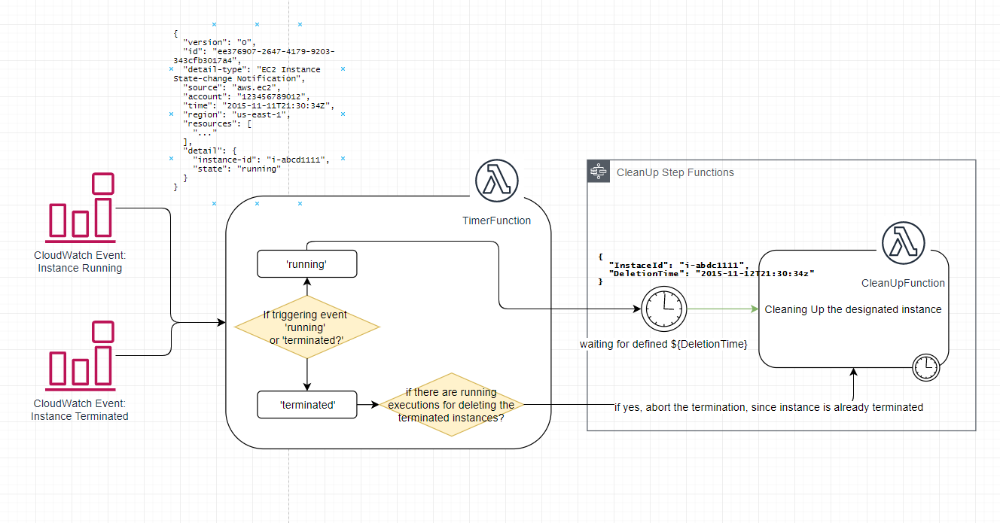

# CleanUpLambda
A solution based on AWS Lambda function and Step Functions to clean up the EC2 instance that has been running for certain hours.

## Solution Overview
CleanUp Overview looks like below diagram 

## Folder Structure
This 

## Deployment method
1. create a S3 bucket called ‘cleanup.lambda.function.modules.${AWS::AccountId}.${AWS::Region}’ in your account
2. upload ‘lambda.zip’ in the bucket root directory
Deploy the solution using ‘cleanUp.yml’ file either in AWS CloudFormation console/CLI/SDK, or SAM deploy
3. Create 3 instances
* One with tag Key as ‘Name’ and Value as ‘cleanUp_test_positive’
* One with tag Key as ‘Name’ and Value as ‘cleanUp_test_negative’ ;furthermore, tag Key as ‘termination_detection’, Value as ‘True’
4. Wait for 24 hours, instance with name ‘cleanUp_test_positive’ should be deleted and instance with name ‘cleanUp_test_negative’ should still survive
5. Any instance deleted within 24 hours will be ignored
6. Tip: to fast forward the test, you can change line 13 in ‘cleanUp.yml’ into 1, and you shall then only wait for one hour for the test result

